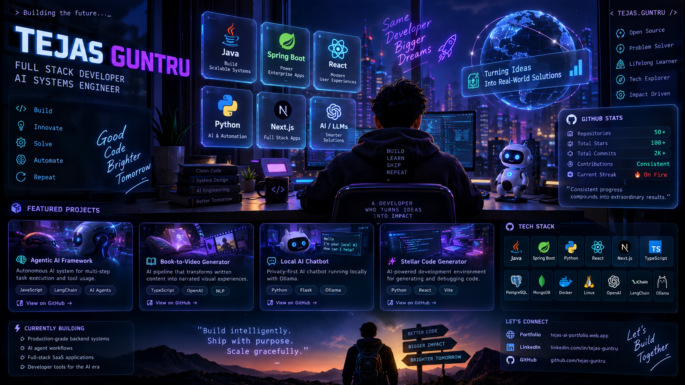

<div align="center">

<!-- ═══════════════════════════════════════════════════════════ -->
<!--                         3D HERO                            -->
<!-- ═══════════════════════════════════════════════════════════ -->



<br><br>

<a href="https://tejas-ai-portfolio.web.app/">

</a>
&nbsp;
<a href="https://linkedin.com/in/tejas-guntru">

</a>
&nbsp;
<a href="https://github.com/tejas-guntru">

</a>

<br><br>


</div>

---

<div align="center">

# `01` — WHO AM I?

### Full Stack Developer · AI Systems Engineer · Backend Developer


</div>

<br>

<table>
<tr>

<td width="50%" valign="top">

## 👨‍💻 `IDENTITY`

```yaml
name: Tejas Guntru
location: Hyderabad, India 🇮🇳

role:
  - Full Stack Developer
  - AI Systems Engineer
  - Backend Developer

mission:
  "Build intelligently.
   Ship with purpose.
   Scale gracefully."